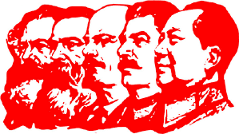

# 马克思主义学习仓库

>- 马克思主义学习库，搜集各种马克思主义学习资源
>- ctrl+f 可以进行全文搜索
>- 更多资源，错误，勘误，指正欢迎通过 issue 或 morningstar1001@163.com 邮件进行联系

# 系统性学习建议

1. 不建议像知乎或者 B 站那样，一开始就阅读毛选，马恩全集这样的书籍，就像你不可能没有学会1+1就求解线性代数一样
2. 如果你是在校大学生，建议认真上好学校的相关课程，在课堂上与老师互动，下课请教问题
3. 如果你觉得学校的这些课程讲的很无聊，或者你已经工作了，你可以在课余时间看看徐涛的《考研政治》视频课程，网盘链接在最下方，徐涛的课讲的非常诙谐幽默，我也是考研期间听了徐涛的课，才开始重新思考马克思主义的
4. 徐涛的课是系统性的，有了他的课程的基础，再去阅读毛选等书籍，就有了理论的基础
5. 关于阅读毛泽东传的重要性
   1. 我认为在整个学习路线中，毛泽东传是非常重要的，我通过一个例子来说明。在考研的时候，我学习到“本本主义”这个名词，当时觉得不明所以，以为是什么高大上的哲学，社会学词汇，后来听了徐涛的课，知道本本主义就是教条主义，“本本”一词就是笔记本的那个本本，但一直没想通，为什么不直接叫教条主义呢，而是要叫本本主义，后来在阅读《毛泽东传（金冲及）》版本的时候才知道，首先《反对本本主义》最早叫《调查工作》和寻乌调查写于同一时间，之所以叫本本主义，是因为那个时候还没有教条主义这个名词，所以用了本本主义。
   2. 毛泽东传就像一本教科书（《毛选》）的背景资料，《毛选》是孤立的文章的合集，而毛泽东传则是这些文章的写作背景，什么时候写的，为什么写的大串联 。譬如，《星星之火，可以燎原》是为了鼓励当时陷入悲观主义的林彪而作。总之，先阅读毛泽东传，可以让你宏观的了解毛选的写作背景，夯实理论基础。

>📙 个人推荐学习路线：徐涛政治课 -> 毛泽东传 -> 红星照耀中国（又名：西行漫记）-> 毛选 -> 其他马恩著作，党史等材料

# 学习资料

## 🔖 学习网站

- ✅ [中文马克思主义文库](https://link.zhihu.com/?target=https%3A//www.marxists.org/chinese/index.html)【几乎所有的马列学习资料都可以在这里找到】
- ✅ [马克思主义研究网](https://link.zhihu.com/?target=http%3A//myy.cass.cn/)
- ✅ [共产党员网](https://link.zhihu.com/?target=http%3A//www.12371.cn/)
- ✅ [旗帜网](https://link.zhihu.com/?target=http%3A//www.qizhiwang.org.cn/)
- ✅ [中国社会科学网](https://link.zhihu.com/?target=http%3A//www.cssn.cn/)

## 📚︎ 相关书籍

- ✅ 毛选 1~5 卷：[mobi](https://link.zhihu.com/?target=https%3A//github.com/Eternaldeath/Marxism-learning-library/blob/master/book/%E6%AF%9B%E6%B3%BD%E4%B8%9C%E9%80%89%E9%9B%86_1-5%E5%8D%B7.mobi)
- ✅ 西方哲学史：[pdf](https://link.zhihu.com/?target=https%3A//gitee.com/fromdark/marxist-learning-library/blob/master/book/%E8%A5%BF%E6%96%B9%E5%93%B2%E5%AD%A6%E5%8F%B2.pdf)
- ✅ [马克思恩格斯全集【巨著，全书共 42668 页】](https://link.zhihu.com/?target=https%3A//www.marxists.org/chinese/marx-engels/index.htm)
- 毛泽东传（金冲及版）
- 红星照耀中国（又名：西行漫记）
- 经济思想史
- 马克思主义哲学的历史和现状_第一卷
- 资本论

## 📙 相关文章

- ✅ [共产党宣言](https://link.zhihu.com/?target=http%3A//news.12371.cn/2018/04/24/ARTI1524567833374896.shtml)
- ✅ [1844年经济学哲学手稿](https://link.zhihu.com/?target=https%3A//www.marxists.org/chinese/marx/marxist.org-chinese-marx-1844.htm)
- ✅ [青年在选择职业时的考虑](https://link.zhihu.com/?target=https%3A//www.marxists.org/chinese/marx/marxist.org-chinese-marx-1835-8.htm)
- ✅ [反杜林社论【马恩全集第二十卷】](https://link.zhihu.com/?target=https%3A//www.marxists.org/chinese/marx-engels/20/001.htm)
- 政治经济学批判
- 帝国主义论
- 哥达纲领批判

## 📹 相关视频

- ✅[考研政治_徐涛](https://pan.baidu.com/s/1GxNotimP-GWaOWqz6oYcPQ#list/path=%2F)【an9v】
- ✅[电影《决裂》赏析_乌鸦校尉](https://pan.baidu.com/s/1EGzvGvvDsABiCSuziq8DsA?pwd=3xk6) 【3xk6】

# 其他

- ✅ 中国社会调查研究：这是一为网名为佐伊23的网友通过招募志愿者做中国各层分析，而得出的当代中国各阶层的分析报告

  - [知乎专栏版](https://zhuanlan.zhihu.com/p/338973792) 【第一期调查报告总结】

  - [完整的知乎专栏](https://www.zhihu.com/column/c_1271946526366044160)  【目前该项目已经进入第二期调查中】

  - [GitHub转存版](https://github.com/facturi/Record/blob/master/佐伊/中国社会调查研究-第一期.md) 【第一期调查报告总结】

- ✅ [一名大二学生的自我反思](https://zhuanlan.zhihu.com/p/387562770)

- ✅ [一个在美国的中国留学生与她的美国同事关于毛泽东的对话](https://zhuanlan.zhihu.com/p/380507674)

- ✅ [我的于勒叔叔](http://blog.sina.com.cn/s/blog_4520ae9a0100l8ml.html)【小学时候学过的一篇文章，印象非常深刻，描述的资本主义下人与人的关系就是一种赤裸裸的金钱关系，有时候觉得我们现在也逐渐沦为了这样的社会关系中】

- ✅ [关于我国人口转型的认识和应对之策_PDF](https://gitee.com/fromdark/marxist-learning-library/blob/master/book/关于我国人口转型的认识和应对之策.pdf)【非常好的文章，对中国目前的情况有一个宏观的了解】

- ✅ [毛选的非常读法](https://zhuanlan.zhihu.com/p/414545266)：很多同志阅读毛选等马克思主义书籍，甚至包括日常生活中，专业学习中的书籍都不得要领，不会读书，这里推荐知乎一位网友的毛选阅读法

